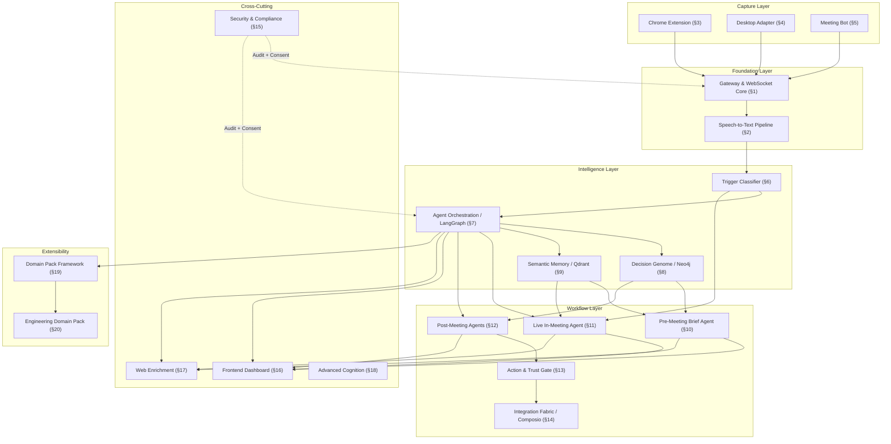

# MeetMind AI — Architecture Overview

## System Architecture

## Build Order

| # | Component | Depends On | Phase |
|---|-----------|------------|-------|
| 0 | Development & Operations Standards | None | Foundation |
| 1 | Backend Ingestion Gateway & WebSocket Core | #0 | Foundation |
| 2 | Speech-to-Text Streaming Pipeline | #1 | Foundation |
| 3 | Chrome/Chromium Extension Capture Adapter | #1, #2 | Foundation |
| 4 | Native Desktop Capture Adapter | #1, #2 | Foundation |
| 5 | Meeting Bot Capture Adapter | #1, #2 | Foundation |
| 6 | Trigger Classification Model | #2 | Intelligence |
| 7 | Agent Orchestration Layer (LangGraph) | #6 | Intelligence |
| 8 | Decision Genome (Neo4j) | #7 | Intelligence |
| 9 | Semantic Memory Layer (Qdrant) | #7, #8 | Intelligence |
| 10 | Pre-Meeting Brief & Battlecard Agent | #8, #9 | Workflow |
| 11 | Live In-Meeting Strategy Agent | #6, #7, #9 | Workflow |
| 12 | Post-Meeting Workflow Agents | #7, #8 | Workflow |
| 13 | Action & Trust Gate | #12 | Workflow |
| 14 | Integration Fabric (Composio) | #13 | Workflow |
| 15 | Security & Compliance Layer | Parallel from #0 | Cross-cutting |
| 16 | Frontend Side Panel / Dashboard | #7, #10, #11, #12, #13 | Cross-cutting |
| 17 | Web Enrichment Tool | #7, #10, #11 | Cross-cutting |
| 18 | Advanced Agent Cognition Upgrade | #7, #11 | Cross-cutting |
| 19 | Domain Pack Framework | #6, #7 | Extensibility |
| 20 | Engineering Domain Pack | #19 | Extensibility |

## Technology Stack

| Layer | Technology | Rationale |
|-------|------------|-----------|
| Backend Runtime | Python 3.12+, FastAPI | Async-first, WebSocket native |
| Agent Orchestration | LangGraph | Stateful agent graphs with checkpointing |
| Graph Database | Neo4j Community Edition | Decision lineage, relationship-rich queries |
| Vector Database | Qdrant | Low-latency semantic search |
| Relational Database | PostgreSQL 16 | ACID compliance, JSONB for flexible payloads |
| Cache / PubSub | Redis 7 | Session state, real-time event distribution |
| Authentication | Clerk | Managed auth, JWT validation via backend SDK |
| Frontend | TypeScript, Vite | Fast builds, HMR, modern tooling |
| Extension | Chrome Manifest V3 | Cross-browser, service worker based |
| Python Tooling | uv, ruff, pytest | Fast, deterministic, async-native |
| JS/TS Tooling | pnpm, ESLint, Prettier, Vitest | Workspace support, consistent formatting |

## Multi-Tenancy Strategy

| Infrastructure | Isolation Strategy | Notes |
|----------------|-------------------|-------|
| PostgreSQL | Schema-based (`tenant_{id}`) | One schema per tenant within a shared database |
| Neo4j CE | Namespace-prefixed labels | CE lacks multi-database; upgrade path to Enterprise |
| Qdrant | Collection-name prefix (`{tenant}_{collection}`) | Logical isolation |
| Redis | Key prefix (`{tenant}:key`) | Namespace isolation |

All services resolve connections through `TenantRouter` in `backend/security/src/tenant.py`.

## Security Invariants

1. **No audio without consent**: Gateway (§1) checks `consent_records` before processing any frame
2. **Append-only audit log**: `audit_events` table — INSERT only, no UPDATE/DELETE
3. **All consent changes audited**: Every `record_consent` / `revoke_consent` call writes to `audit_events`
